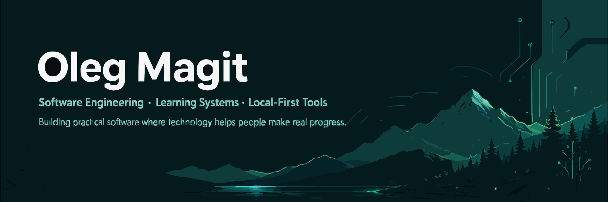

<div align="center">



# Hi, I'm Oleg Magit

### Software Engineering Student · Builder of practical tools · Learning by building

I’m a B.Sc. Software Engineering student at Sami Shamoon College of Engineering in Israel, expected to graduate in 2028.

I’m currently focused on building real software products that help people organize, learn, and make progress — especially in education, local-first apps, and human-centered tools.

I’m still early in my professional journey, but I care deeply about writing understandable code, improving through projects, and building systems that solve real problems.

[](https://www.linkedin.com/in/olegmagit/)
[](https://github.com/Oleg-Magit)
[](mailto:olegmagit@gmail.com)

</div>

---

## What I’m building toward

I want to become a software engineer who can turn unclear problems into working systems.

My current direction combines:

- **Software engineering fundamentals** — OOP, SOLID, data structures, clean architecture.
- **Practical web development** — React, TypeScript, local-first apps, PWAs.
- **Education technology** — tools that help people learn, track progress, and grow.
- **AI-assisted development** — using AI tools carefully to plan, audit, debug, and improve engineering workflows.

I believe good software is not only about code.  
It is about understanding people, constraints, systems, and the small decisions that make a product useful.

---

## Featured Projects

<table>
  <tr>
    <td width="50%">
      <h3>AcademPazam</h3>
      <p>
        A local-first academic degree progress tracker built as a Progressive Web App.
        It helps students plan courses, track credits, monitor progress, export reports,
        and keep ownership of their data.
      </p>
      <p>
        <b>Focus:</b> privacy-first academic planning, offline usage, multilingual UI,
        PDF export, structured degree tracking.
      </p>
      <p>
        <b>Stack:</b> React, TypeScript, Vite, IndexedDB, PWA, PDF export.
      </p>
      <a href="https://github.com/Oleg-Magit/academpazam-app">
        View Repository
      </a>
    </td>
    <td width="50%">
      <h3>TeamSprintUp</h3>
      <p>
        A hackathon MVP for a school learning platform that simulates high-tech teamwork
        through roles, tasks, sprints, approvals, progress tracking, and AI-assisted learning hints.
      </p>
      <p>
        <b>My role:</b> Product & Technical Contributor.
        I helped shape the product flow, teamwork logic, user roles, MVP direction,
        GitHub workflow, and validation discussions.
      </p>
      <p>
        <b>Achievement:</b> 2nd place at Moshal Hackathon 2026.
      </p>
      <p>
        <b>Stack exposure:</b> NestJS, Nuxt 3, TypeScript, Supabase/PostgreSQL, Tailwind CSS.
      </p>
      <a href="https://github.com/i-sh-sh/Moshal_Hackathon_26">
        View Repository
      </a>
    </td>
  </tr>
</table>

---

## Technical Skills

### Languages


### Web & Tools


### Concepts I’m practicing

- Object-Oriented Programming
- SOLID principles
- Basic data structures and algorithms
- Local-first application design
- Progressive Web Apps
- Git/GitHub workflows
- System design fundamentals
- Clean, readable, maintainable code

---

## How I work

I try to work like an engineer, even while I’m still learning:

```txt
Understand the problem
        ↓
Break it into smaller parts
        ↓
Build the smallest useful version
        ↓
Test and verify behavior
        ↓
Improve structure and clarity
        ↓
Document what changed and why

I prefer honest progress over exaggerated claims.
When I work on a team, I care about communication, responsibility, and keeping people moving in the same direction.

Background that shaped me

Before focusing on software engineering, I worked in technical and operational environments:

Vehicle electronics and low-voltage systems.
Mobility and field operations.
Team coordination and daily workflow management.
Academic mentoring and peer tutoring.

That background taught me to think practically: systems must work not only in theory, but also for real people under real constraints.

Current learning focus
Java & OOP              ████████░░
Git/GitHub workflow     ███████░░░
System design basics    █████░░░░░
AI-assisted engineering ███████░░░

Values I bring to projects
I learn quickly and ask precise questions.
I prefer clear structure over messy speed.
I care about users, not only code.
I enjoy helping teams organize, move forward, and try to get best results.

Languages
Hebrew — Native
Russian — Fluent
English — Working proficiency, actively improving
```
<div align="center">
Building step by step — from student projects to real software impact.
</div> 
